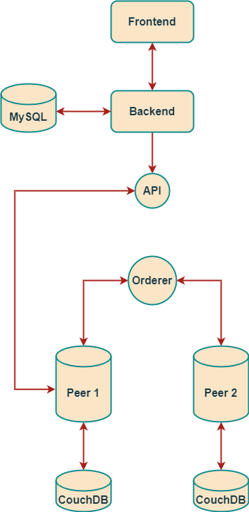

# KWallet Backend

This repository contains the backend and database components of the KWallet project. The backend is built using Go, and it interfaces with MySQL and Redis databases. The backend also interacts with a Hyperledger Fabric blockchain through a gateway API.

## Table of Contents

1. [Project Structure](#project-structure)
   - [Directory Explanation](#directory-explanation)
2. [System Architecture](#system-architecture)
3. [How to Run](#how-to-run)
   - [Prerequisites](#prerequisites)
   - [Setup](#setup)
4. [Mini Explanation of Backend and Database](#mini-explanation-of-backend-and-database)
   - [Backend](#backend)
   - [Database](#database)
     - [MySQL Configuration](#mysql-configuration)
     - [Redis Configuration](#redis-configuration)
5. [Related Links](#related-links)

## Project Structure

```plaintext
erc20-Backend/
│
├── Api Collection/
│   └── coinpayment.postman_collection.json
│
├── blockchain/
│   └── gateway.go
│
├── controllers/
│   ├── auth.go
│   ├── blockchainActions.go
│   └── dbActions.go
│
├── middlewares/
│   └── middlewares.go
│
├── models/
│   ├── setup.go
│   └── user.go
│
├── utils/token/
│   └── token.go
│
├── .env
├── docker-compose.yml
├── go.mod
├── go.sum
├── main.go
└── requirements.txt
```

### Directory Explanation

- **Api Collection:** Contains Postman collections for API testing.
- **blockchain:** Contains code to interact with the Hyperledger Fabric blockchain.
- **controllers:** Contains the main business logic for handling requests and interacting with the database and blockchain.
- **middlewares:** Contains middleware functions for request handling.
- **models:** Contains database models and setup logic.
- **utils/token:** Contains utility functions for token generation and validation.

## System Architecture



The system architecture is composed of the following components:

1. **Frontend:** The user interface built with Vite and React.
2. **Backend:** The server-side application built with Go. It handles API requests and interacts with the database and blockchain.
3. **API:** The gateway API that allows the backend to communicate with the blockchain network.
4. **Orderer:** Part of the Hyperledger Fabric network, responsible for ordering transactions and ensuring the consistency of the blockchain.
5. **Peer Nodes:** Nodes in the Hyperledger Fabric network that maintain the ledger and execute smart contracts.
6. **Databases:**
    - **MySQL:** Stores relational data required by the backend.
    - **Redis:** Serves as a cache to improve performance.
    - **CouchDB:** Used by the Hyperledger Fabric peer nodes to store the blockchain state.


## How to Run

### Prerequisites

- Docker
- Go (version 1.16 or later)
- MySQL (configured in `docker-compose.yml`)
- Redis (configured in `docker-compose.yml`)

### Setup

1. Clone the repository:

    ```bash
    git clone https://github.com/Kiana8181/erc20-Backend.git
    cd erc20-Backend
    ```

2. Start the Docker containers:

    ```bash
    docker-compose up -d
    ```

3. Run the Go server:

    ```bash
    go run main.go
    ```

## Mini Explanation of Backend and Database

### Backend

The backend is built using the Go programming language. It handles authentication, blockchain interactions, and database operations. The main entry point of the backend is `main.go`, which sets up the HTTP server and routes.

### Database

The backend uses MySQL as the primary database for storing user information and other relational data. Redis is used as a cache to improve performance. The `docker-compose.yml` file sets up the MySQL and Redis instances.

#### MySQL Configuration

The MySQL configuration is specified in the `docker-compose.yml` file.

#### Redis Configuration

The Redis configuration is also specified in the docker-compose.yml file.

## Related Links
[Blockchain Repository](https://github.com/Kiana8181/erc20-Blockchain)


[Frontend Repository](https://github.com/Kiana8181/erc20-Frontend)
